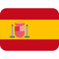

<h1> Hi, I'm Rary! 👋🏽👨🏽‍💻</h1>

<!-- These flags are found on https://emojipedia.org/flags/ and the Twitter emoji version is being used here -->

<a href="https://help.rescue.org/donate-br/ukraine-crisis" target="_blank"><b> donate to Ukraine </b></a>

<!-- 
 -->
<!--   
<h4>ABOUT ME</h4>
 -->
<h4>ABOUT ME</h4>

  I'm a brazilian <b>Software Developer</b> with experience in <b>Web Development</b> using <b>Python</b> <i>(Flask and Django)</i>. I am also an enthusiast of the <b>DevOps</b> culture as an agile methodology in the software development and currently learn about <b>Docker</b> and <b>Kubernetes</b>.

  Currently I'm working as a <i>Python Developer</i> at <a href="https://devgrid.co.uk" target="_blank"><b>DevGrid</b></a>, based in <i>United Kingdom</i>, where I am contributing with <i>international teams</i> and delivering products with <i>quality</i> and <i>commitment</i> to customers in <b>United Kingdom</b>, <b>United States</b> and <b>Europe Union</b>.

  As well I'm studying the <b>Information Technology</b> <i>(bachelor's degree)</i> with emphasis in <i>Software Development</i> at <a href="https://www.metropoledigital.ufrn.br" target="_blank"><b>Metrópole Digital</b></a> institute, from <a href="https://ufrn.br" target="_blank"><b>Federal University of Rio Grande do Norte</b></a>.

<!-- 
 -->

<!-- 
 -->
<!--   
<h4>MY SKILLS</h4>
 -->
  
<!--   <i>{ under development }</i> -->
<!-- 
 -->

   
  <!-- These icons are found on https://simpleicons.org/ as .svg (a work on Figma was done to color and convert to png) -->
  
  
  
  
  
  
  
  <b>Rary Coringa</b>
   Software Developer
   <i>contact@rary.dev</i>

   <a href="https://www.rary.dev/" target="_blank"><pre>rary.dev © 2022</pre></a>

